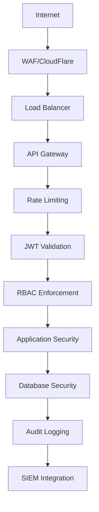

# System Architecture Overview

This document provides a comprehensive overview of the Yggdrasil MSP/CRM/ERP platform architecture, component interactions, and design decisions.

> **Version Note**: This architecture is designed for **v0.5 MVP** (8-12 weeks). Technology stack and component details are qualified as v0.5, v1.0+, or future versions where applicable. See technology tables for version-specific requirements.

## Executive Summary

Yggdrasil is a modern, cloud-native MSP/CRM/ERP platform built with a microservices architecture, supporting multi-tenant operations with high availability and scalability.

## Core Principles

- **Microservices Architecture**: Decoupled services with independent deployment
- **API-First Design**: All communication via well-defined APIs
- **Multi-Tenant by Default**: Row-level security with optional database isolation
- **Event-Driven**: Asynchronous communication for scalability
- **Cloud-Native**: Designed for container orchestration and auto-scaling
- **Security by Design**: Zero-trust model with defense in depth

## High-Level Architecture

```
┌─────────────────────────────────────────────────────────────────────┐
│                    ┌─────────────────┐                              │
│                    │   Web Portal    │                              │
│                    └─────────────────┘                              │
│                                                                     │
│  ┌─────────────┐    ┌───────────────┐      ┌─────────────┐          │
│  │   Web App   │    │ Control Plane │     │   Agents     │          │
│  │  (React/TS) │   │    (Go/Chi)  │    │   (Go)       │         │
│  └─────┬─────. ┘    └───────┬──────┘         └─────┬─────┘                 │
│        │                  │                      │                  │
│  ┌───────┐    ┌─────────────────────────────────────────────┐       │
│  │  CDN  │    │            PostgreSQL + TimescaleDB         │    │
│  └───────┘    └─────────────────────────────────────────────┘    │
│         │                    │               │             │          │
│  ┌─────────────────────────────────────────────────────┐    │
│  │              NATS Message Broker                │    │
│  └─────────────────────────────────────────────────────┘    │
└─────────────────────────────────────────────────────────────────────┘
```

## Component Overview

### 1. Control Plane (Go/Chi)

**Responsibilities:**

- User authentication and authorization
- Business logic and workflows
- API gateway and orchestration
- Multi-tenant data isolation
- Integration with external services

**Key Features:**

- RESTful and gRPC APIs
- JWT-based authentication with OAuth 2.0
- Role-based access control (RBAC)
- Row-level security (RLS) implementation
- Structured logging with slog
- Async task processing with NATS
- Domain-driven design with clean architecture

### 2. Web Application (React/TypeScript)

**Responsibilities:**

- User interface for MSP staff
- Customer portal (Bifröst)
- Real-time dashboard and reporting
- Responsive design with mobile support

**Key Features:**

- Modern React 18+ with TypeScript
- Component-based architecture
- State management with Redux/Zustand
- TailwindCSS with shadcn/ui components
- TanStack Query for data fetching
- Progressive Web App (PWA) capabilities

### 3. Agent (Go)

**Responsibilities:**

- System monitoring and metrics collection
- Remote task execution
- Plugin system for extensibility
- Secure communication with control plane

**Key Features:**

- Lightweight Go binary
- Plugin architecture for extensibility
- mTLS for secure communication
- Metrics collection and reporting
- Configurable execution schedules
- Auto-update and self-healing capabilities

### 4. Database (PostgreSQL + TimescaleDB)

**Primary Database:**

- PostgreSQL for relational data
- TimescaleDB for time-series metrics
- Row-level security for multi-tenancy
- Connection pooling and optimization

**Key Features:**

- Multi-AZ deployment for high availability
- Read replicas for read scaling
- Time-series data compression
- Automated backups and point-in-time recovery
- Query optimization and indexing

### 5. Message Broker (NATS)

**Purpose:**

- Service communication and decoupling
- Event-driven architecture support
- Queue-based task processing (v0.5 MVP solution)
- Real-time notifications

**Key Features:**

- JetStream for persistence
- At-least-once delivery
- Subject-based routing
- Clustering for high availability (v1.0+)
- Authentication and authorization

**Note**: NATS JetStream is the v0.5 solution for background task processing. Celery may be evaluated for v1.0+ if more complex workflow orchestration is needed.

## Technology Stack

### Backend Technologies

| Component      | Technology    | Version | v0.5 | v1.0+ | Purpose                         |
| -------------- | ------------- | ------- | ---- | ----- | ------------------------------- |
| API Framework  | Chi + Go      | 1.22+   | ✓    | ✓     | High-performance HTTP router    |
| Authentication | golang-jwt    | 5.0+    | ✓    | ✓     | JWT tokens (RS256)              |
| Database       | PostgreSQL    | 15+     | ✓    | ✓     | Relational data                 |
| Time Series    | TimescaleDB   | 2.8+    | ✓    | ✓     | Metrics and analytics           |
| Message Broker | NATS          | 2.9+    | ✓    | ✓     | Event streaming & task queue    |
| Query Builder  | sqlc          | 1.25+   | ✓    | ✓     | Type-safe SQL generation        |
| Caching        | Redis         | 7.0+    |      | ✓     | Session and query cache (v1.0+) |
| Search         | Elasticsearch | 8.11+   |      | ✓     | Full-text search (v1.0+)        |

### Frontend Technologies

| Component        | Technology     | Version | Purpose           |
| ---------------- | -------------- | ------- | ----------------- |
| Framework        | React          | 18.2+   | UI framework      |
| Language         | TypeScript     | 5.0+    | Type safety       |
| Build Tool       | Vite           | 5.0+    | Fast development  |
| Styling          | Tailwind CSS   | 3.4+    | Utility-first CSS |
| Components       | shadcn/ui      | Latest  | Component library |
| State Management | Redux Toolkit  | 2.0+    | State management  |
| Data Fetching    | TanStack Query | 5.0+    | Server state      |
| Testing          | Vitest         | Latest  | Unit testing      |

### Infrastructure Technologies

| Component        | Technology     | Version | v0.5 | v1.0+ | Purpose                      |
| ---------------- | -------------- | ------- | ---- | ----- | ---------------------------- |
| Containerization | Docker         | 20.10+  | ✓    | ✓     | Application packaging        |
| CI/CD            | GitHub Actions | Latest  | ✓    | ✓     | Build automation             |
| Reverse Proxy    | Nginx          | 1.24+   |      | ✓     | Load balancing (v1.0+)       |
| Orchestration    | Kubernetes     | 1.25+   |      | ✓     | Container management (v1.0+) |
| Monitoring       | Prometheus     | 2.40+   |      | ✓     | Metrics collection (v1.0+)   |
| Logging          | ELK Stack      | Latest  |      | ✓     | Centralized logging (v1.0+)  |

## Data Flow

### User Request Flow

```
┌─────────────┐    ┌─────────────┐    ┌─────────────┐
│ Web Client │ → │   Control Plane │ → │   Database    │
└─────────────┘    └─────────────┘    └─────────────┘
                      ↑
                      ┌─────────────┐
                      │  Message     │
                      │  Broker      │
                      └─────────────┘
```

### Agent Communication Flow

```
┌─────────────┐    ┌─────────────┐    ┌─────────────┐
│    Agent   │ → │   Message     │ → │   Control Plane │
└─────────────┘    │   Broker      │    └─────────────┘
                      ↑
                      ┌─────────────┐
                      │  Message     │
                      │  Broker      │
                      └─────────────┘
```

## Multi-Tenancy Model

### Row-Level Security (RLS) Implementation

Yggdrasil implements PostgreSQL Row-Level Security for multi-tenant data isolation:

```sql
-- Example RLS Policy
CREATE POLICY tenant_isolation ON tickets
FOR ALL
USING (tenant_id)
CHECK (tenant_id = current_setting('app.current_tenant_id')::int);

-- Automatic tenant context setting
SET app.current_tenant_id = 123; -- For tenant 123
```

**Benefits:**

- Database-level enforcement (cannot be bypassed)
- Performance efficient
- Easy to manage and audit
- Transparent to applications
- Supports both SaaS and deployment models

### Database Isolation Options

| Model        | Description        | Complexity | Cost   | Performance |
| ------------ | ------------------ | ---------- | ------ | ----------- |
| **RLS**      | Row-level security | Low        | Good   | Good        |
| **Schema**   | Separate schemas   | Medium     | Medium | Good        |
| **Database** | Complete isolation | High       | Poor   | Best        |

## Security Architecture

### Defense in Depth



### Security Controls

**Network Security:**

- Web Application Firewall (WAF)
- DDoS protection
- SSL/TLS encryption
- Network segmentation

**Application Security:**

- Input validation and sanitization
- SQL injection prevention
- XSS protection
- CSRF protection

**Data Security:**

- Encryption at rest and in transit
- Key management and rotation
- Data loss prevention (DLP)

**Access Control:**

- Multi-factor authentication (MFA)
- Role-based access control
- Privileged access management
- Session management

## Deployment Architecture

### High Availability Design

```
┌─────────────────────────────────────────────────────────────┐
│                  Multiple Availability Zones                │
│                  ┌─────────┐    ┌─────────┐    │
│  ┌──────────────┐ │   Primary   │    │   Secondary  │    │
│  │   Primary    │   │  Data Center  │    │   Data Center  │    │
│  │   Region     │   │      └──────┘    │    │      └──────┘    │
│  │              │   │                   │    │                   │    │
│  └──────────────┘ │   │                   │    │                   │    │
│                  └─────────────────────────┘    │                   │    │                   │    │
│                      ┌─────────────────────────────┐    │
│                      │    Global Load Balancer     │    │
│                      └─────────────────────────────┘    │
│                      │                   │    │                   │    │
│                      ┌─────────────────────────────┐    │
│                      │    DNS Failover              │    │
│                      └─────────────────────────────┘    │
│                      │                   │    │                   │    │
└─────────────────────────────────────────────────────────────┘
```

### Scalability Patterns

**Horizontal Scaling:**

- Auto-scaling groups for web application
- Database read replicas
- Message queue partitioning
- Microservices with independent scaling

**Vertical Scaling:**

- Database instance sizing
- Compute resource allocation
- Storage tier management
- Performance optimization

## Performance Considerations

### Database Performance

**Read Optimization:**

- Read replicas for query distribution
- Connection pooling with pgBouncer
- Query optimization and indexing
- Materialized views for complex queries

**Write Performance:**

- Connection pooling with write optimization
- Batch inserts for high volume
- Asynchronous write queues
- TimescaleDB hypertables for time-series

### Caching Strategy

**Application Caching:**

- Redis for session and frequent data
- CDN for static assets
- Application-level caching
- Database query result caching

**Database Caching:**

- Query result caching
- Prepared statement caching
- Function result caching
- Plan caching with PostgreSQL

## Integration Patterns

### External System Integration

**Authentication Providers:**

- OAuth 2.0 / OpenID Connect
- SAML 2.0 support
- LDAP/Active Directory integration
- Custom SSO providers

**Communication Channels:**

- Email providers (SMTP, SendGrid)
- SMS providers (Twilio, Vonage)
- Slack/Microsoft Teams integration
- Webhook support for real-time events

**Monitoring Integration:**

- Prometheus federation
- Grafana dashboards
- ELK Stack for log aggregation
- Alertmanager for unified alerting

## Evolution Roadmap

### Current Architecture (v1.0)

**Focus Areas:**

- Core MSP functionality
- Basic CRM features
- Agent-based monitoring
- Multi-tenant architecture

### Future Architecture (v2.0+)

**Planned Enhancements:**

- Event sourcing for audit trails
- CQRS pattern for scalability
- Service mesh for communication
- Advanced analytics platform
- Machine learning integration
- Edge computing capabilities

---

This system architecture provides the foundation for understanding Yggdrasil's design principles, technology choices, and operational patterns. For detailed implementation specifics, refer to the specialized architecture documents in this directory.

**Focus Areas:**

- Core MSP functionality
- Basic CRM features
- Agent-based monitoring
- Multi-tenant architecture

### Future Architecture (v2.0+)

**Planned Enhancements:**

- Event sourcing for audit trails
- CQRS pattern for scalability
- Service mesh for communication
- Advanced analytics platform
- Machine learning integration
- Edge computing capabilities

---

This system architecture provides the foundation for understanding Yggdrasil's design principles, technology choices, and operational patterns. For detailed implementation specifics, refer to the specialized architecture documents in this directory.
